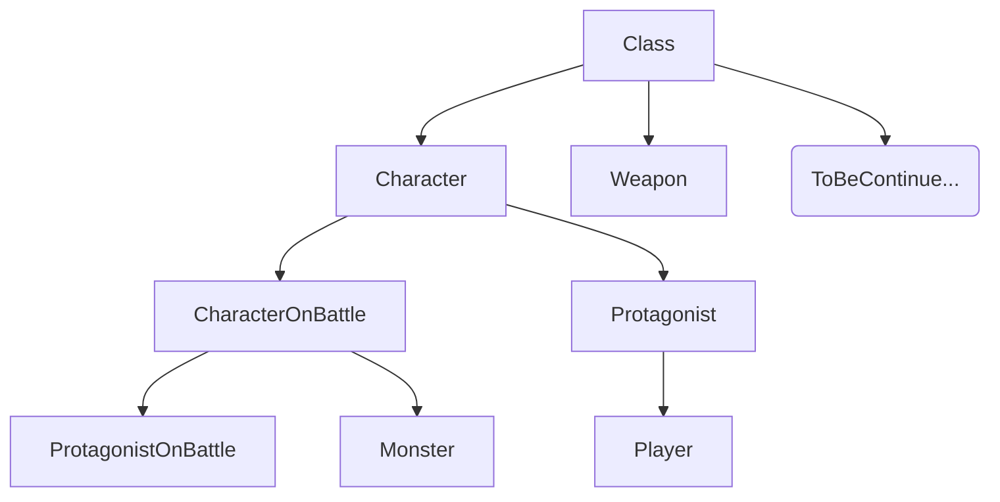

# 类

目前类的设计思路是：



因为属性有点多，考虑到性能原因，将战斗内外的属性隔离开来，目前采用的是继承的方式，以后会考虑用组件式，但是我还不会 btw

---

参考代码：（函数功能还没加，得知晓了具体战斗内的功能按键再设计

```cpp
// class.h
#pragma once
#include <string>

class Weapon
{
    // todo
};

class Character
{
protected:
    std::string name;
    int         level;
    int         HP;
    std::string race;

public:
    std::string getName() const
    {
        return name;
    };
    int getLevel() const
    {
        return level;
    };
    int getHP() const
    {
        return HP;
    };
    std::string getRace() const
    {
        return race;
    };
};

class CharacterOnBattle : public Character
{
protected:
    struct defence
    {
        int physical;
        int magical;
    };
    int speed;
    int movement;
    int crit; // 暴击

public:
    virtual int attack();
};

/*
在战斗时的主角团
*/
class ProtagonistOnBattle : public CharacterOnBattle
{
    int    SP;          // 蓝量
    Weapon nowEquipped; // 现在持有的武器
};

/*
怪物属性
*/
class Monster : public CharacterOnBattle
{
    struct anti // 抗性
    {
        int physical;
        int magical;
    };
    struct damage // 伤害
    {
        int physical;
        int magical;
    };
};

class Protagonist : public Character
{
    int strength; // 体力
    int favour;   // 好感度
    int exp;      // 技能点
};

class Player : public Protagonist
{
    int luck;
    int right;   // 正义值
    int fatigue; // 疲劳值
};
```

如果没啥问题，那就考虑起战斗内的功能按键吧，我得设计函数了 (要烧头发了)